# Lab Title: Snort Challenge - The Basics

**Platform:** TryHackMe  
**Category:** Network Analysis / IDS&IPS  
**Difficulty:** Intermediate

---

## Objective

investigate a series of traffic data and stop malicious activity under different scenarios through customization of rules in Snort and inspection of log files

---

## Skills Demonstrated

- Network Traffic Analysis
- Signature-Based Detection
- Custom Rule Development and Troubleshooting 
- Network Threat Detection

---

## Tools Used

- Snort
- Linux command-line utilities (`grep`, `cut`, `strings`)

---

## Methodology

During this lab, I learned how to configure Snort, analyze packet captures and network traffic, execute Snort in different operating modes, and develop custom detection rules to identify malicious network activity.
As a first step, I verified the installed Snort version and executed it in **Test Mode** to ensure that the configuration file was valid before creating any custom rules.

*Instance version and configuration validation*
- 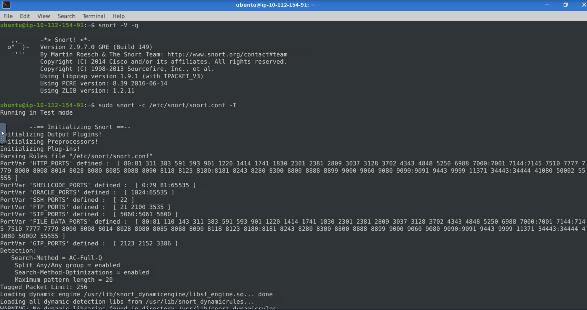

### HTTP Traffic Detection

The first exercise focused on creating an IDS rule to detect all HTTP traffic over TCP port **80**.

*HTTP traffic detection rule*
- 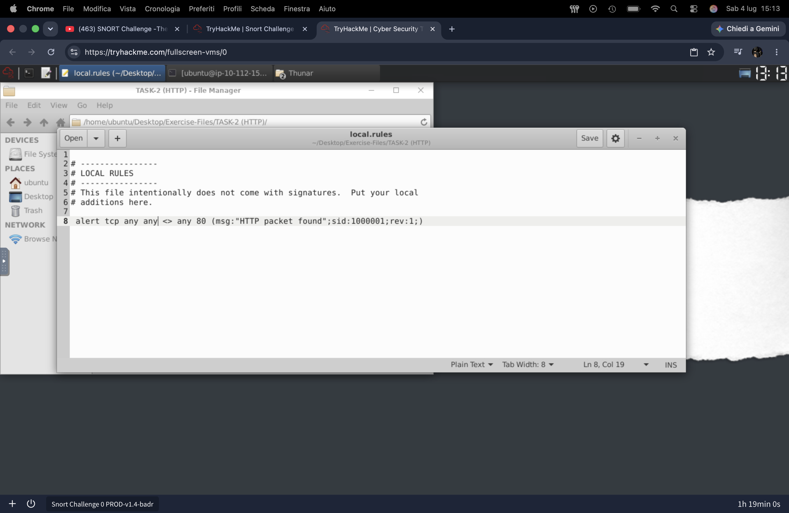

The rule was then tested by running Snort in **IDS Mode** using a packet capture file:

```bash
sudo snort -c ./local.rules -A full -r file.pcap -l .
```

The generated log file was subsequently analyzed to verify that the rule correctly detected the expected network traffic.

---

### FTP Traffic Analysis

The next scenario focused on detecting FTP authentication activity by creating multiple custom rules capable of identifying different login attempts.

The implemented rules included:

- Failed FTP login attempts
- Successful FTP logins
- FTP logins with a valid username but no password
- FTP login attempts using the **Administrator** username without a password

- *FTP authentication detection rules*
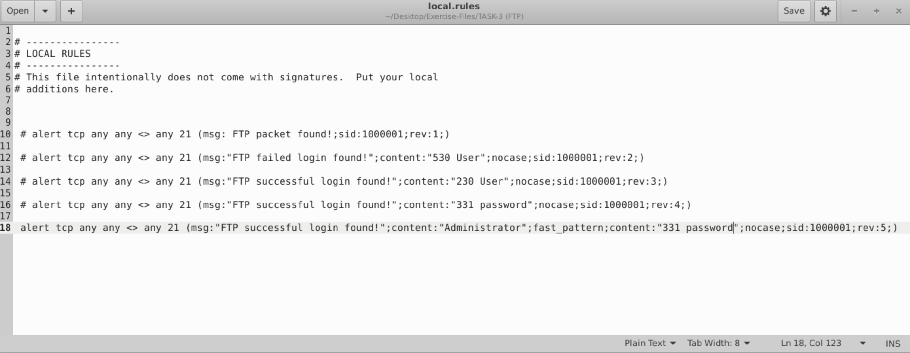

---

### File Type Detection

I also developed rules capable of detecting specific file signatures transmitted over the network, including:

- PNG files
- GIF files
- Torrent metafiles

- *File signature detection rules*
 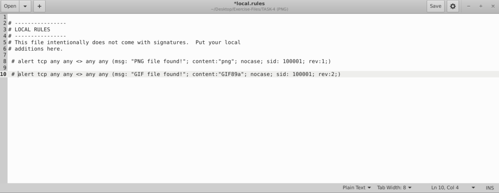

- *Torrent detection rule*
 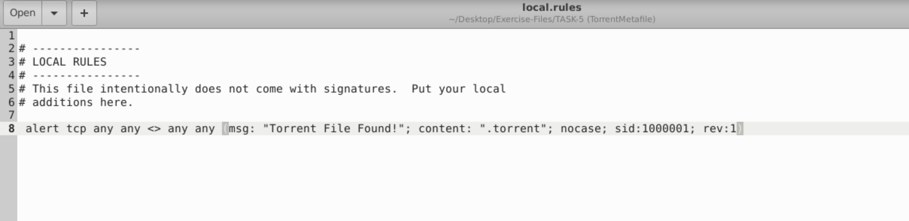

-  *Torrent traffic analysis*
 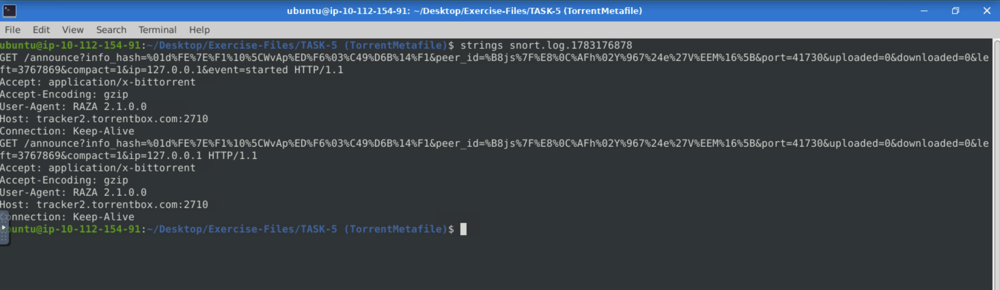

---

### Rule Troubleshooting

Part of the lab focused on troubleshooting incorrectly written Snort rules by identifying and correcting syntax errors.

- *Rule troubleshooting examples*
 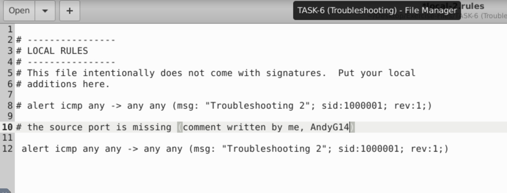
 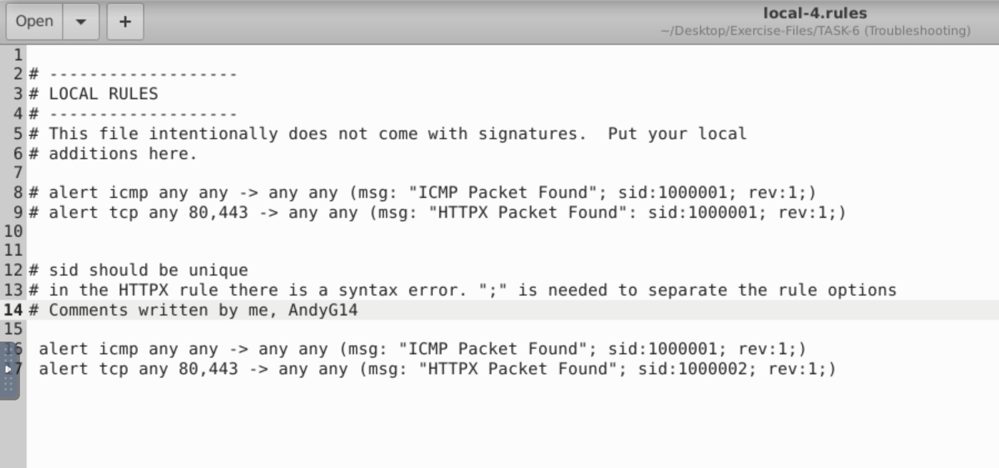
 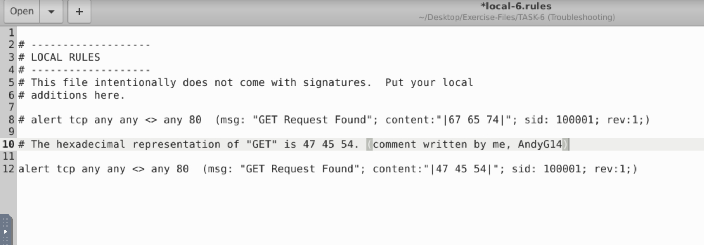

---

### Vulnerability Detection

Finally, I created and tested rules to detect well-known vulnerabilities and attack patterns, including:

- Detection of **MS17-010** exploitation attempts by inspecting traffic for **IPC$** access.
- Detection of **Log4Shell (Log4j)** exploitation attempts using custom local rules.
- Customization of detection rules by filtering packets within a specific size range.

- *MS17-010 detection rule*
 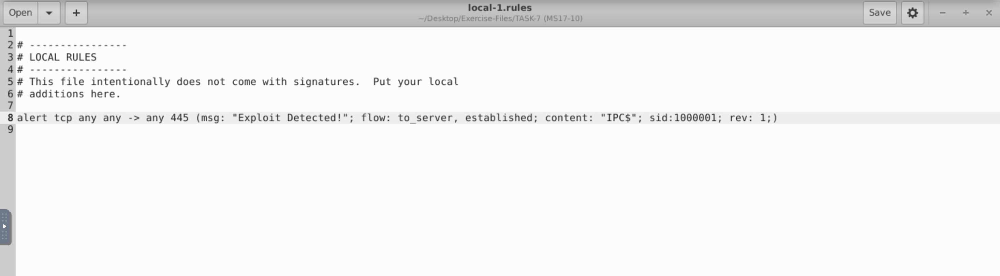

- *Log4j log filtering to identify the rules activated*
 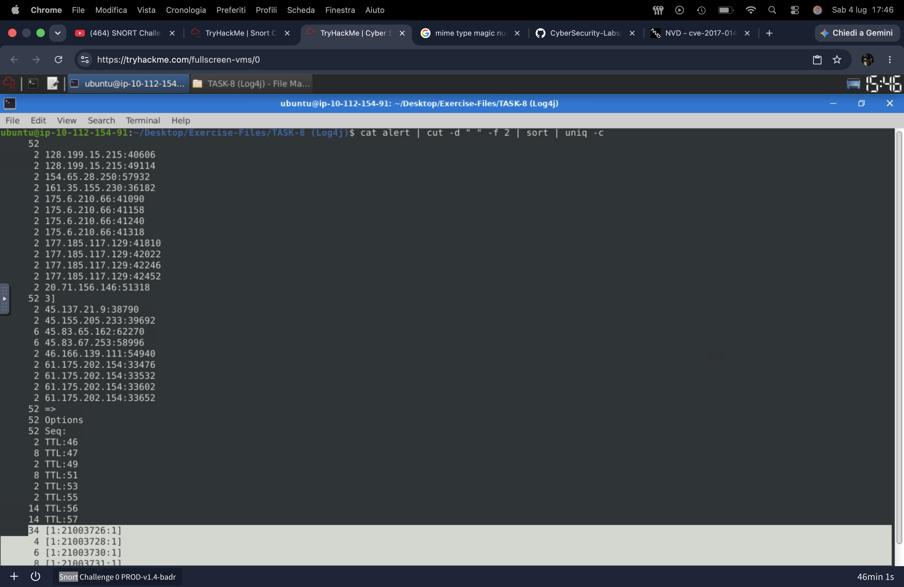

-  *Customized Log4j rule for specific size range*
 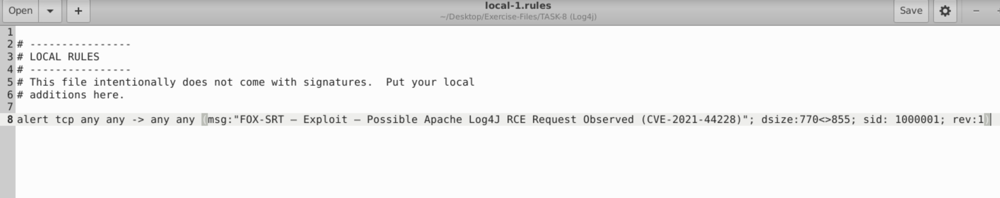
  


---

## Key Takeaways

- Improved my understanding of how Snort detects malicious network activity using signature-based detection.
- Learned how to write, validate, and troubleshoot custom IDS rules for different network protocols and attack scenarios.
- Gained hands-on experience analyzing packet captures to verify detection rules and investigate network traffic.
- Better understood the importance of accurate rule writing to improve detection capabilities while reducing false positives.

---

## Real-World Relevance

**Intrusion Detection Systems (IDS) and Intrusion Prevention System (IPS)** are essential as they continuously monitor and protect network traffic from malicious activity. Understanding how detection and prevention rules are written, tested, and refined enables security analysts to identify threats, investigate suspicious traffic, and improve detection and prevention capabilities.
