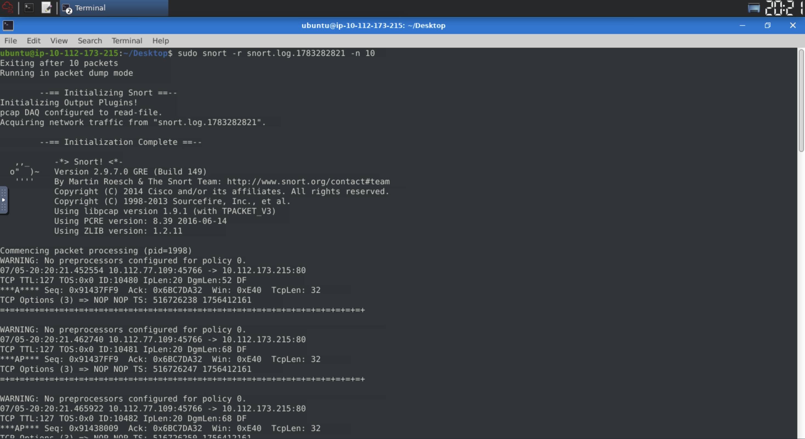
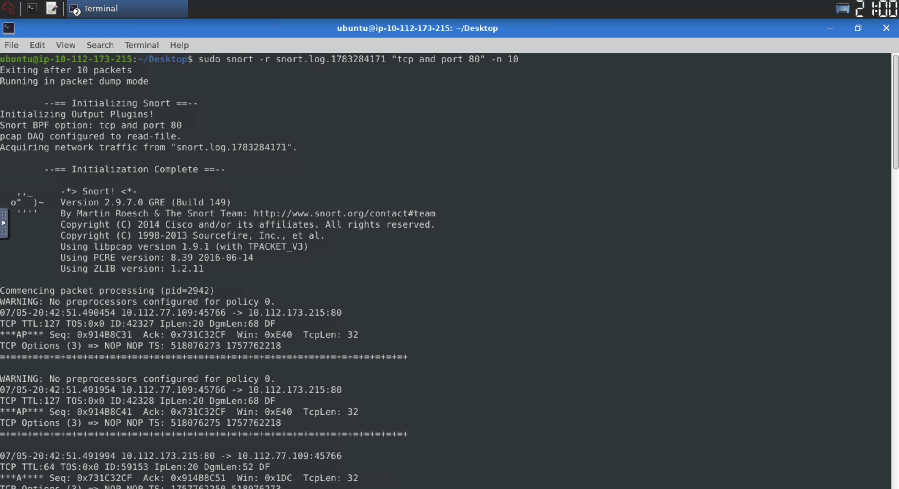
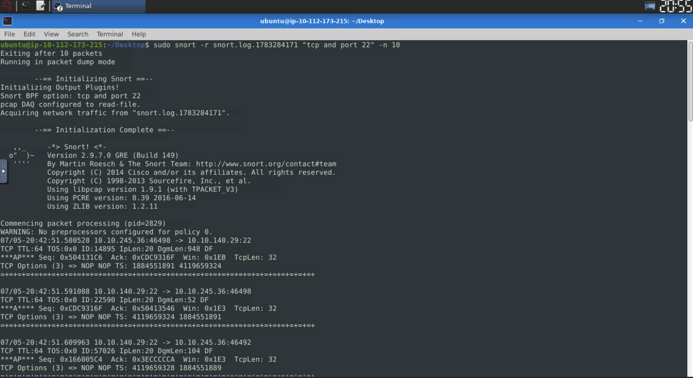
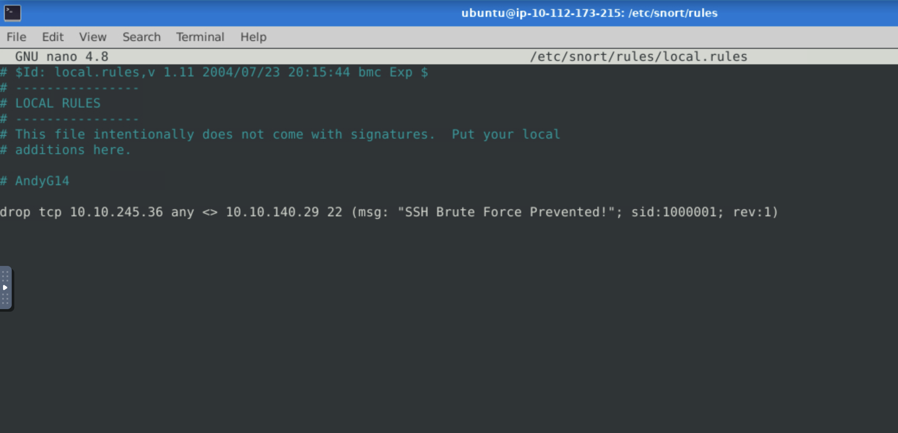
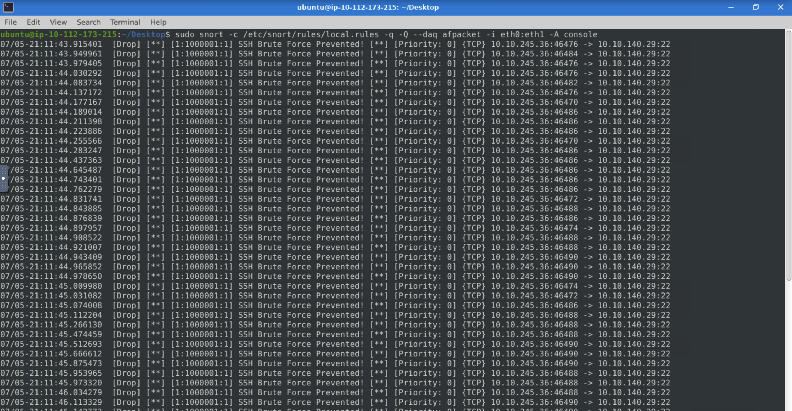

# Lab Title: Snort Challenge: Live Attacks

**Platform:** TryHackMe  
**Category:** Network Analysis / Incident Response / IDS & IPS  
**Difficulty:** Intermediate

---

## Objective

This lab focuses on investigating network traffic and stopping malicious activities.
We are going to use Snort to analyze both live and captured traffic and customize IPS rules to actively stop attacks in two different scenarios.

---

## Skills Demonstrated

- Network Traffic Analysis
- Identifying Malicious Activities
- Customizing IPS Rules During Live Attacks

---

## Tools Used

- Snort

---

## Scenario 1: Brute-Force Attack

As a first step, I ran Snort in **sniffing mode** to confirm the brute-force attack behavior on the network. After confirming the malicious activity, I ran Snort in **logging mode** to capture the network traffic and generate a log file for further analysis.

Once the log file was created, I parsed it using Snort:

The inspection revealed a large amount of traffic targeting both **port 80** of the web server and **port 22**.

I then applied log filtering to analyze the captured traffic in greater detail.

The traffic on **port 80** was significantly higher, but after careful analysis, I determined that it was legitimate web browsing traffic.

Next, I filtered the traffic on **port 22**, which clearly revealed a brute-force attack against the SSH service.

After identifying the source IP address of the malicious activity, I customized a rule inside the **local.rules** file to block the attack.

Finally, I executed Snort in **IPS mode** to verify that the custom rule successfully prevented the attack.

---

## Key Takeaways

- Improved my understanding of how Snort can prevent malicious network activity.
- Learned how to write, validate, and customize IPS rules.
- Gained hands-on experience analyzing network traffic to identify brute-force attacks and stop them in real time.
- Better understood the importance of accurate rule writing to improve prevention capabilities while minimizing false positives.
---

## Real-World Relevance

Brute-force attacks are among the most common techniques used by threat actors to gain unauthorized access to exposed services. Security analysts rely on Intrusion Detection and Prevention Systems (IDS/IPS) such as Snort to monitor live network traffic, identify malicious behavior, and automatically block attacks before they can compromise critical systems.

