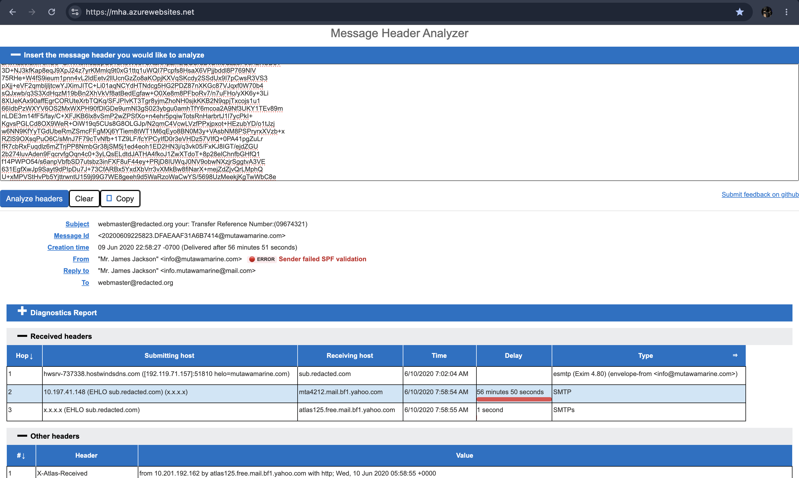
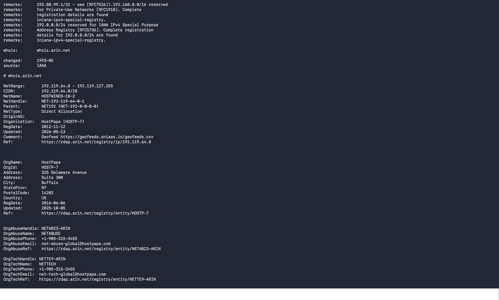
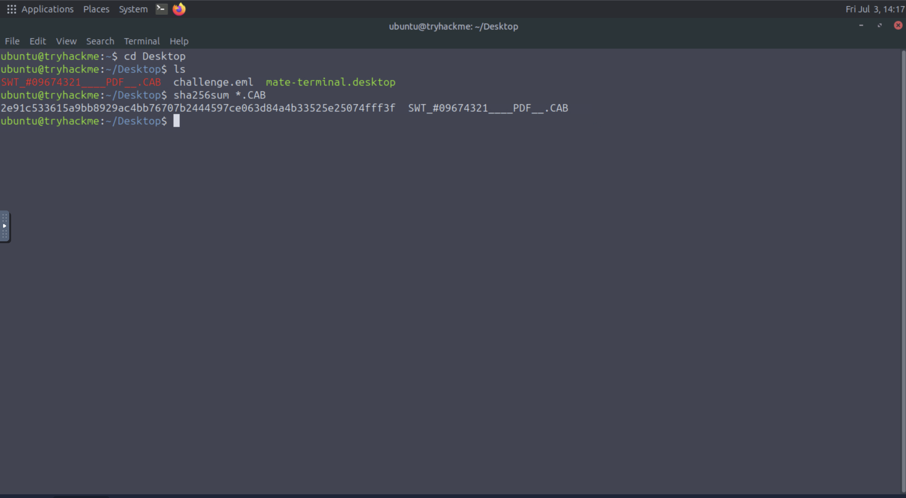
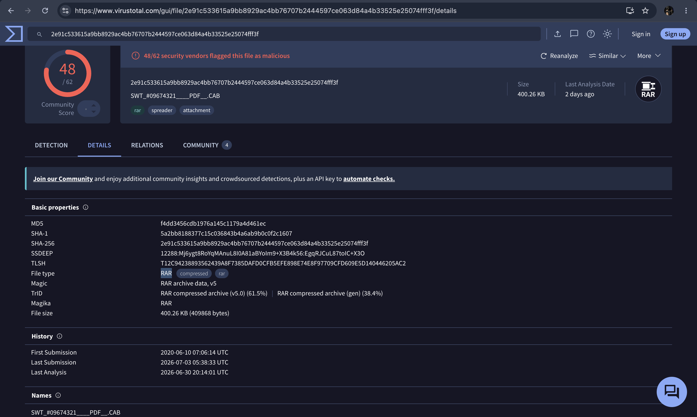

# Phishing Analysis

**Platform:** TryHackMe  
**Room:** The Greenholt Phish  
**Category:** Phishing Analysis  
**Difficulty:** Beginner

---

## Objective

Analyze and investigate a suspicious email to identify and extract key artifacts, determine its origin and authenticity, and assess the potential maliciousness of the email.

---

## Skills Demonstrated

- Email Header Analysis
- Phishing Detection and Investigation
- Attachment Analysis

---

## Tools Used

- VirusTotal
- `sha256sum`
- WHOIS
- Message Header Analyzer
- SPF Surveyor
- DMARC Inspector

---

## Methodology

My methodology in this lab was to apply the concepts I learned about phishing email analysis.

I started by analyzing the email headers, both manually and using **Message Header Analyzer**, paying particular attention to the **Return-Path**, which appeared suspicious, and to the failed **SPF** validation.

After analyzing the headers and obtaining information about the source IP address using **WHOIS** (which identified the owner as HostPapa), I proceeded with the attachment analysis.

I saved the attachment without opening it, generated its **SHA256** hash using the `sha256sum` command, and submitted it to **VirusTotal**. The analysis confirmed that the attachment was a known Trojan and revealed that its actual file type was a **RAR archive**.

---

## Evidence

### Email Header Analysis

*Using a **Message Header Analyzer** to analyze the email's headers.*

---

### Identifying the IP source

*Using **WHOIS** to idenity the owner of source IP.*

---

### Hashsum of the Attachment

*Using **sha256sum** to obtain the SHA256 hash of the attachment*

### Analyize the File's Hash with VirusTotal

*Using **VirusTotal** to analyze the suspicious attachment and file type*

---

## Key Takeaways

- Learned how to identify phishing indicators within email headers.
- Understood the importance of verifying suspicious attachments before interacting with them.
- Improved my ability to recognize sender spoofing techniques.

---

## Real-World Relevance

Phishing remains one of the most common social engineering techniques used by threat actors to gain initial access or any malicious activity.

The ability to analyze suspicious emails, validate email authentication mechanisms such as SPF, DKIM, and DMARC, inspect attachments, and identify phishing indicators is a fundamental skill for SOC analysts and Incident Responders. These capabilities help organizations detect phishing attempts early and reduce the risk of compromise.
