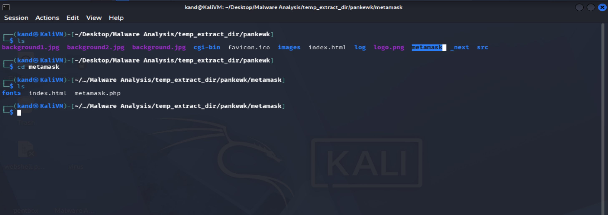
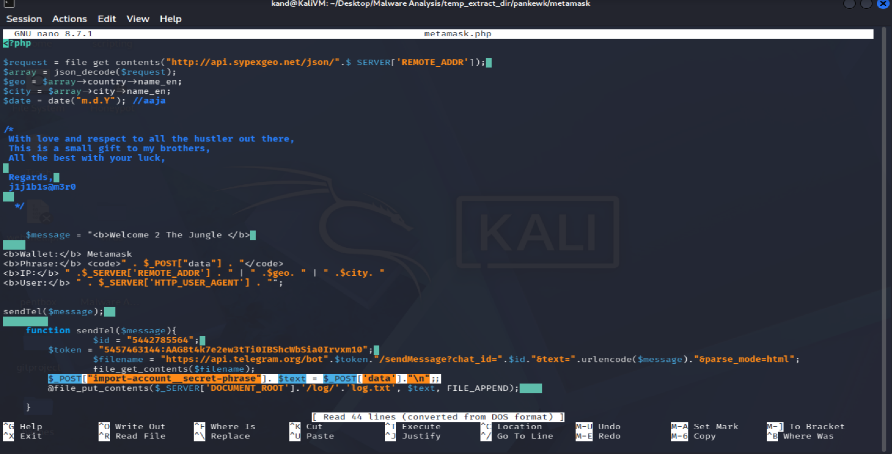
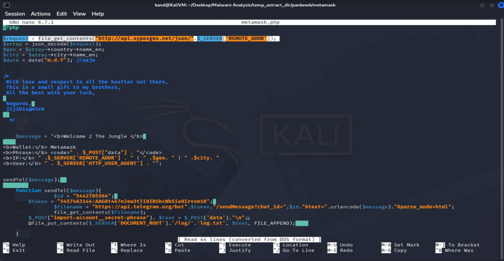
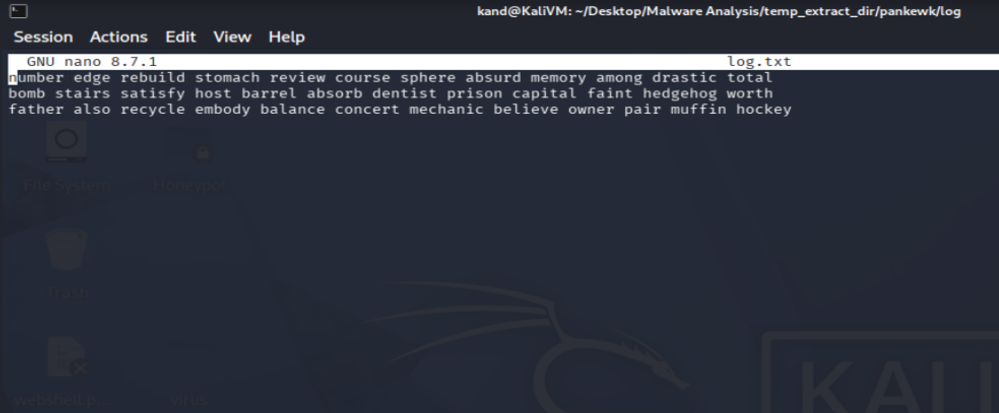
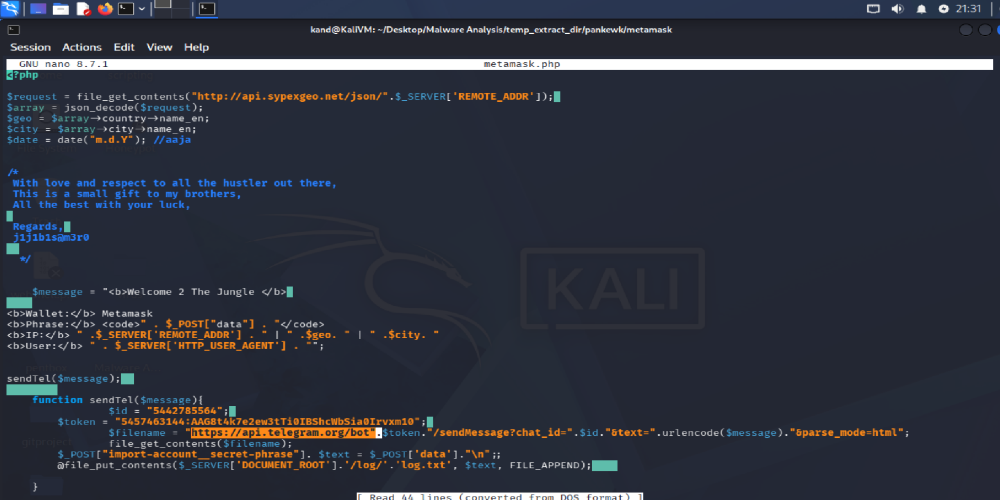

# Lab Title: GrabThePhiser

**Platform:** Cyberdefenders  

**Category:** Threat Intelligence   

---

## Objective

Analyze a cryptocurrency phishing kit to identify exfiltration methods, extract critical IOCs, and gather threat actor intelligence using local logs and Telegram APIs.

---

## Skills Demonstrated

- Phishing Kit Analysis
- Threat Intelligence
- IOC Analysis

---

## Tools Used

- Text Editor

---

## Methodology

This lab focuses on analyzing a phishing kit targeting cryptocurrency users to understand how it operates, identify Indicators of Compromise, and investigate the attacker's infrastructure through artifact correlation and threat intelligence analysis.

As a first step, I identified which cryptocurrency wallet the phishing kit was impersonating to steal user's seed phrases. After extracting the ZIP archive, I noticed a folder named **MetaMask**, indicating that the attack specifically targets users of this wallet.

I then opened the folder and found a **PHP** file named **metamask.php**. Using a text editor (**nano**), I analyzed the php file and identified the malicious functionality implemented by the attacker.

The phishing page prompts victims to enter sensitive information, such as their MetaMask wallet **seed phrase**, under the guise of restoring access to their accounts.

Continuing the analysis, I identified that **Sypex Geo** is used by the attacker to collect information about the victim's machine, such as its geolocation.

The next step was to determine how many seed phrases had already been collected by the threat actor. In the main directory, I found a **log.txt** file used to store all the captured seed phrases.

As the final part of the analysis, I determined which communication channel was used for credential exfiltration. By examining the PHP script, I identified a **Telegram Bot** used as the medium for **data exfiltration**. 

Within the same section of the script, I also retrieved the **Telegram Bot API Token** and the **Chat ID**, which are used by the attacker to receive the stolen data instantly.

---

## Key Takeaways

- Learned how to analyze and interpret phishing kit scripts to understand their functionality and identify malicious behavior.
- Improved my ability to identify IOCs and correlate attacker-controlled infrastructure.
- Gained hands-on experience investigating phishing campaigns targeting cryptocurrency users and understanding how stolen credentials are collected and exfiltrated.

---

## Real-World Relevance

Cryptocurrency phishing campaigns continue to target users by impersonating legitimate wallet providers and stealing sensitive information such as seed phrases. The ability to analyze phishing kits, interpret their scripts, and extract valuable IOCs enables security analysts to investigate attacker infrastructure, support threat intelligence activities, and respond more effectively to phishing incidents.
