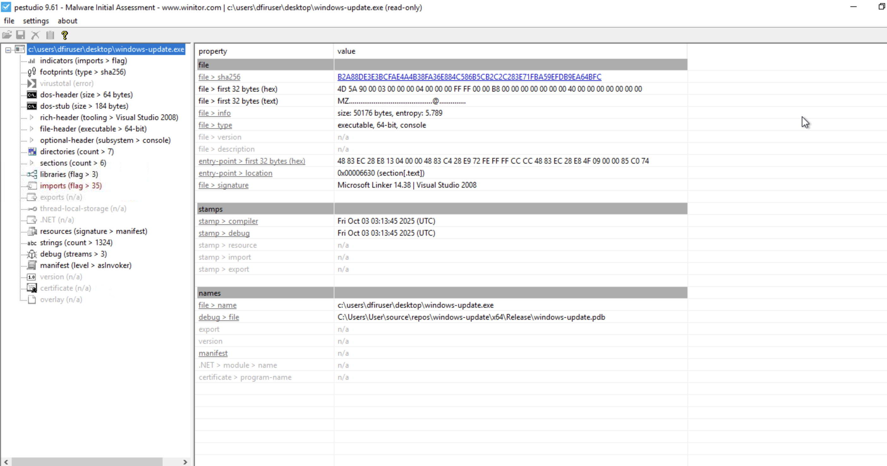
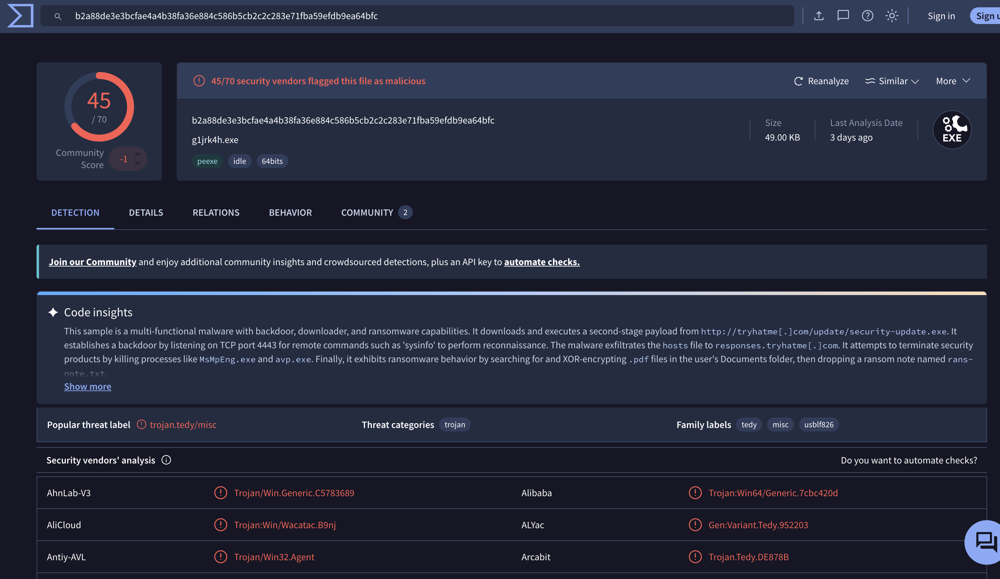
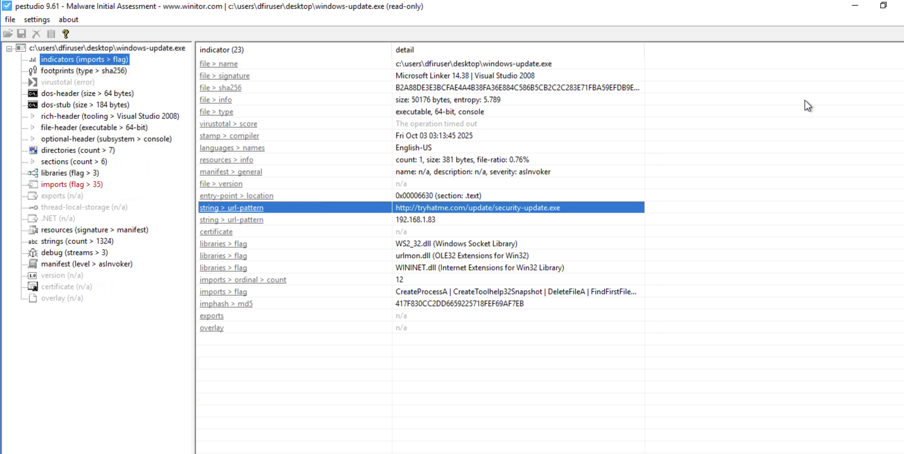
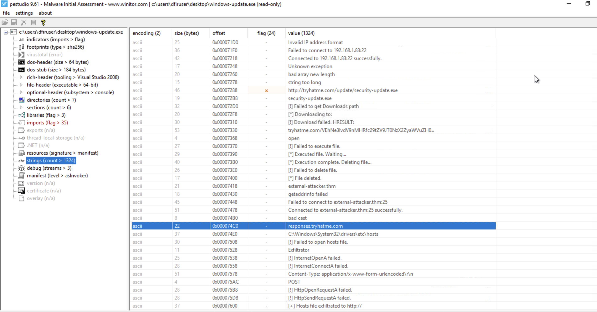
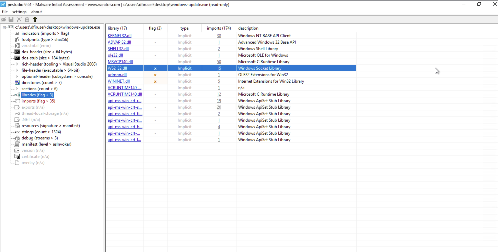
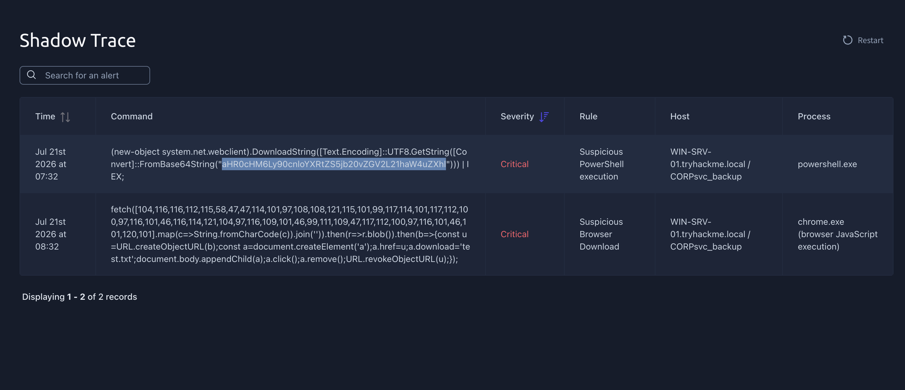
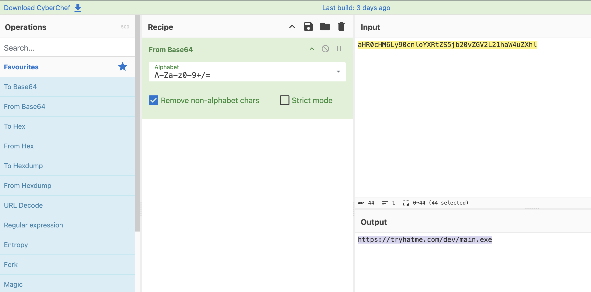
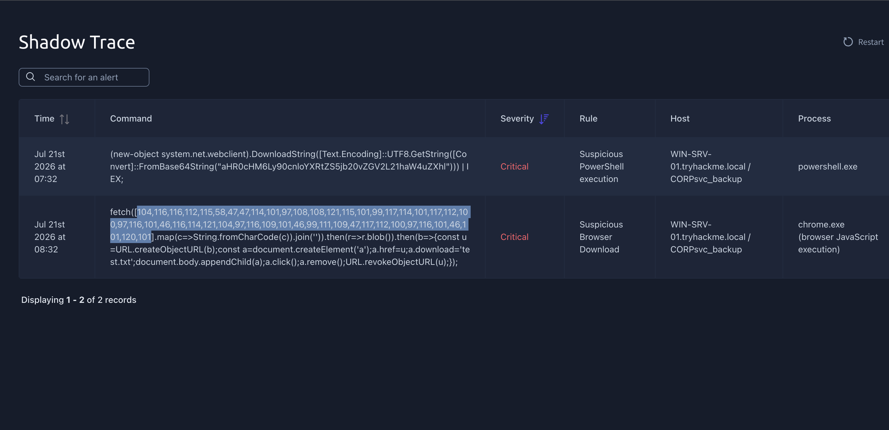
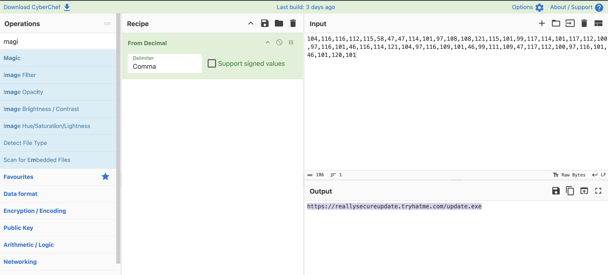

# Lab Title: Shadow Trace

**Platform:** TryHackMe

**Category:** Malware Analysis 

---

## Objective

Analyze forensic artifacts to identify the investigated file, collect relevant IOCs, and correlate security alerts to determine whether the observed activity is malicious.

---

## Skills Demonstrated

- Threat Investigation
- Alert Analysis
- IOCs Analysis

---

## Tools Used

- PEStudio
- VirusTotal
- CyberChef

---

## Methodology

The lab begins by providing the suspicious artifact to investigate, along with several tools that can be used during the analysis. 

I chose **PEStudio**, as it allows me to identify suspicious indicators, verify file hashes on **VirusTotal**, and detect anomalies before executing the sample. 

The investigation is divided into two phases: **File Analysis** and **Alerts Analysis**.

### File Analysis

As a first step, I identified the architecture of the binary and retrieved its unique **SHA256** hash.

I then searched the hash on **VirusTotal**, which quickly confirmed that the binary was malicious.

The next objective was to identify potential IOCs. I examined the **indicators** of PEStudio and identified a suspicious URL that appears to be used as a malware payload delivery endpoint.

Continuing the static analysis examining the **strings** of the malware using PEStudio, I found a reference to a suspicious domain, indicating a potential communication endpoint used by the malware.

> **Note:** This task also required decoding a **Base64** encoded flag found in the **Strings** section. I used **CyberChef** to decode the value.

The final step of the file analysis was to identify the library responsible for socket communication that is loaded by the binary.

### Alerts Analysis

After completing the file analysis, I moved on to the **Alerts Analysis** phase. 

This part of the investigation focused on correlating the previously identified IOCs with the generated alerts to better understand the malware's behavior.

The first task was to identify the malicious URL referenced in the alert triggered by **powershell.exe**.

The URL was **Base64** encoded, so I used **CyberChef** to decode it and recover the original address.

Next, I analyzed the alert triggered by **chrome.exe** to identify another malicious URL.

In this case, the URL was decimal encoded. Once again, I used **CyberChef** to decode it and retrieve the original URL.

---

## Key Takeaways

- Learned how to perform static malware analysis to identify suspicious artifacts and extract valuable IOCs.
- Improved my ability to correlate security alerts with malware artifacts to better understand malicious behavior and attacker activity.
- Gained hands-on experience using tools such as PEStudio, VirusTotal, and CyberChef to support malware investigations and IOC analysis.

---

## Real-World Relevance

Static malware analysis is a fundamental skill for security teams when investigating suspicious files after a potential compromise.
By identifying malware characteristics, extracting Indicators of Compromises, and correlating them with security alerts, analysts can better understand malicious activity, assess the impact of an incident, and support effective incident response.
