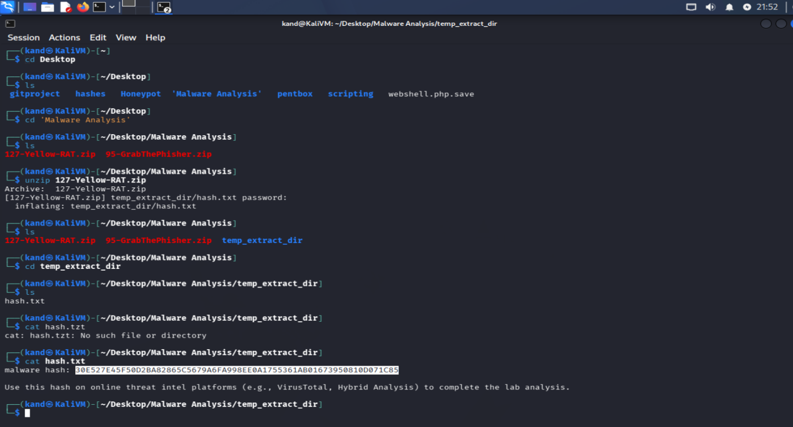
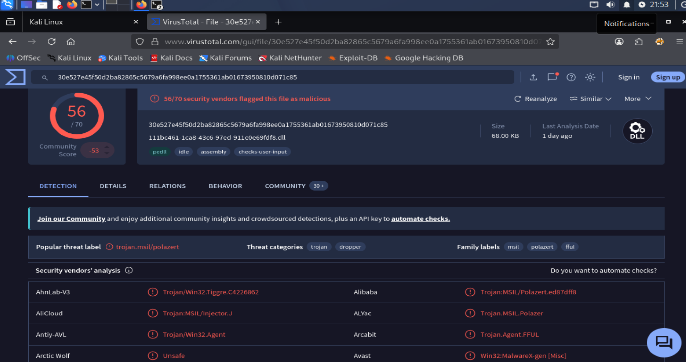
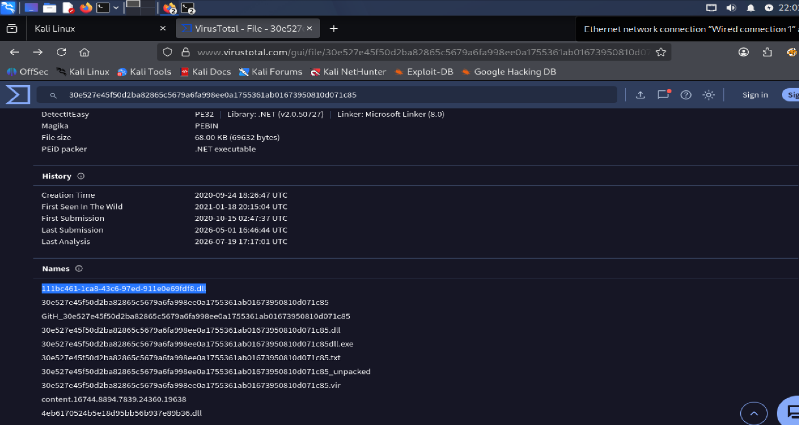
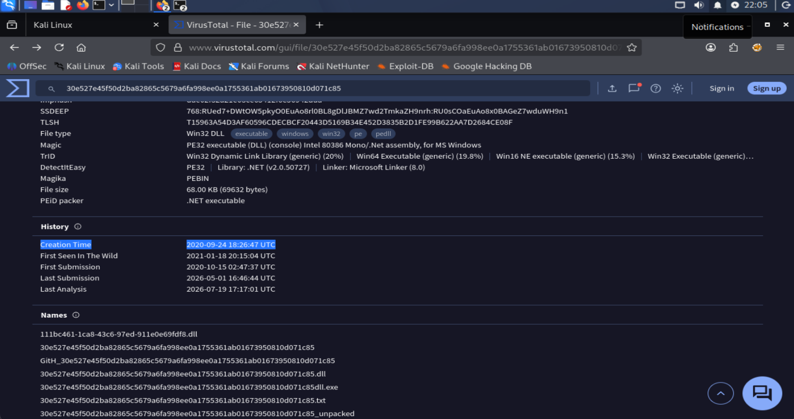
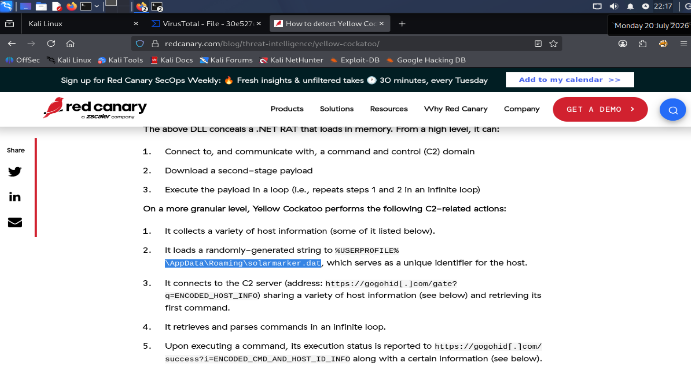
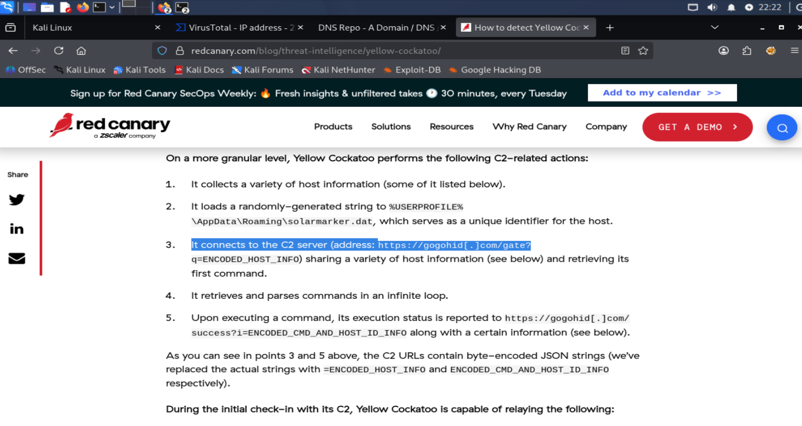

# Lab Title: Yellow RAT lab

**Platform:** Cyberdefenders 

**Category:** Threat Intelligence / Malware Analysis  

---

## Objective

Analyze malware artifacts using threat intelligence platforms like VirusTotal to identify IOCs, C2 servers, and understand adversary tactics.

---

## Skills Demonstrated

- Malware Analysis
- Threat Intelligence
- IOCs Identification

---

## Tools Used

- VirusTotal
- Red Canary

---

## Methodology

As a first step, I downloaded the ZIP file provided by the lab and transferred it to a dedicated virtual machine, which I use as a secure environment for malware analysis.

After extracting the archive, I retrieved the **SHA256** hash of the sample and searched for it on **VirusTotal**. The scan results clearly determined that the sample is malicious

The first objective of the analysis was to identify the malware family responsible for the abnormal network activity. The sample was identified as **Yellow Cockatoo RAT**.
I then determined the common filename used by the malware, information that can be useful for identifying additional infected hosts during an investigation.

Next, I examined both the malware creation timestamp and the first submission timestamp on VirusTotal. Comparing these timestamps helps estimate how long the malware may have been active before being detected.

The following task required identifying the components dropped by the malware. To achieve this, I analyzed the sample using **Red Canary** reports, where I identified the dropped components.

Finally, **Red Canary** also provided information about the **Command and Control (C2) server** used by the malware, allowing me to identify the infrastructure it communicates with.

---

## Key Takeaways

- Learned how to identify malware families and gather key intelligence using threat intelligence platforms such as VirusTotal and Red Canary.
- Improved my ability to extract and analyze Indicators of Compromise (IOCs), including file hashes, filenames, and Command and Control (C2) infrastructure.
- Gained hands-on experience correlating malware artifacts with threat intelligence to support incident investigation and detection activities.

---

## Real-World Relevance

Effective malware analysis begins with the ability to identify and correlate malware artifacts and Indicators of Compromise (IOCs) using trusted threat intelligence sources such as VirusTotal and Red Canary.
Developing these foundational threat intelligence skills helps security analysts understand malware families, identify attacker infrastructure, and assess the potential impact of an infection.
This contextual analysis is essential for supporting threat detection, incident response, and informed decision-making within a Security Operations Center.
