# Lab Title: Logless Hunt (Walkthrough)

**Platform:** TryHackMe  

**Category:** Windows Log Analysis 

---

## Objective

The objective of this lab is to become familiar with different Windows log sources, including Security, PowerShell, RDP, Task Scheduler, and Windows Defender logs. Throughout the investigation, we analyze a realistic attack scenario, from the initial web exploitation to credential access and persistence.

---

## Skills Demonstrated

- Windows Log Analysis
- Event Correlation
- Incident Investigation
- Attack Timeline Reconstruction

---

## Tools Used

- Event Viewer
- PowerShell

---

## Scenario

After an IPS alert reporting suspicious network activity, the IT team reviewed the Windows Security and System Event Logs but found them completely empty, concluding that no compromise had occurred.

A few days later, the company's website was compromised and several servers experienced unusually high CPU usage. During the investigation, attention shifted to the legacy **HR01-SRV** server after a spike in HTTP traffic from the users' subnet was detected.

The objective is to analyze the available artifacts and determine whether the server contains evidence of the attack despite the absence of traditional Windows Event Logs.

## Methodology

Due to the nature of this lab, the investigation has been divided into individual tasks following the order of the walkthrough. Each task focuses on a specific objective and demonstrates the investigative process used to identify artifacts and reconstruct the attack using Windows logs.

**NOTE:** The number of the tasks does not correlate to the real task number of the room in TryHackMe.

### Task 1: Initial Access | Web Access Logs

The first task focuses on identifying the attacker's initial access through the analysis of the web access logs.

As a first step, I browsed the web application hosted on **HR01-SRV** over port **80** to gather some basic information about the target. I then moved to `C:\Apache24\Logs\access.log` using **PowerShell** to begin the log analysis.

From the access log, I identified the attacker's IP address while scanning the web application:

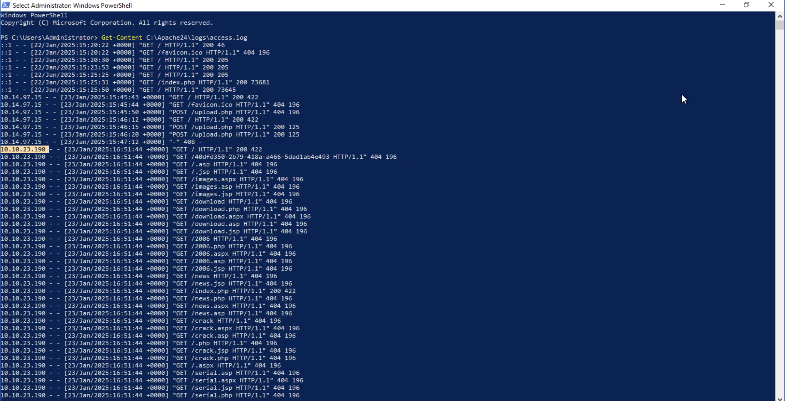

Continuing the investigation, I observed suspicious **HTTP POST** requests used to upload a file to the server:

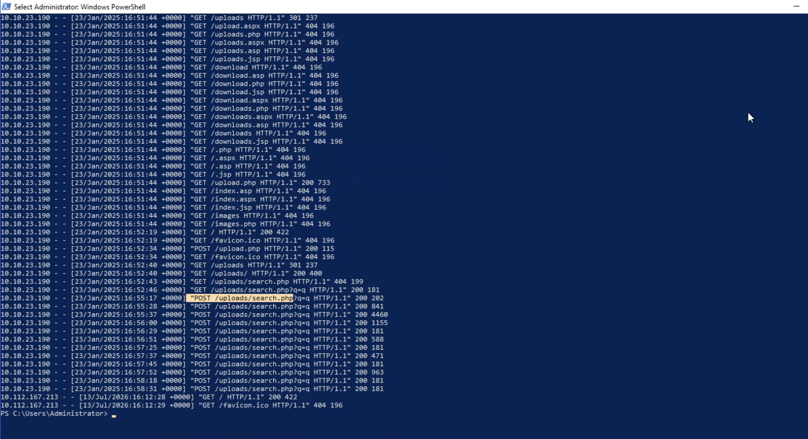

After analyzing the requests and the subsequent activity, I determined that the uploaded file was a **web shell**, as the attacker repeatedly used it to execute commands remotely on the compromised server.

---

### Task 2: From Web to RDP | PowerShell Logs

The objective of this task is to determine what the attacker uploaded and executed through the web shell.

I initially examined the `ConsoleHost_history.txt` file, but it contained only limited information. I then switched to **Event Viewer** and analyzed the **PowerShell Operational Logs**, which provided much more detailed evidence.

The first malicious activity I identified was the command used to download a binary from the attacker's web server:

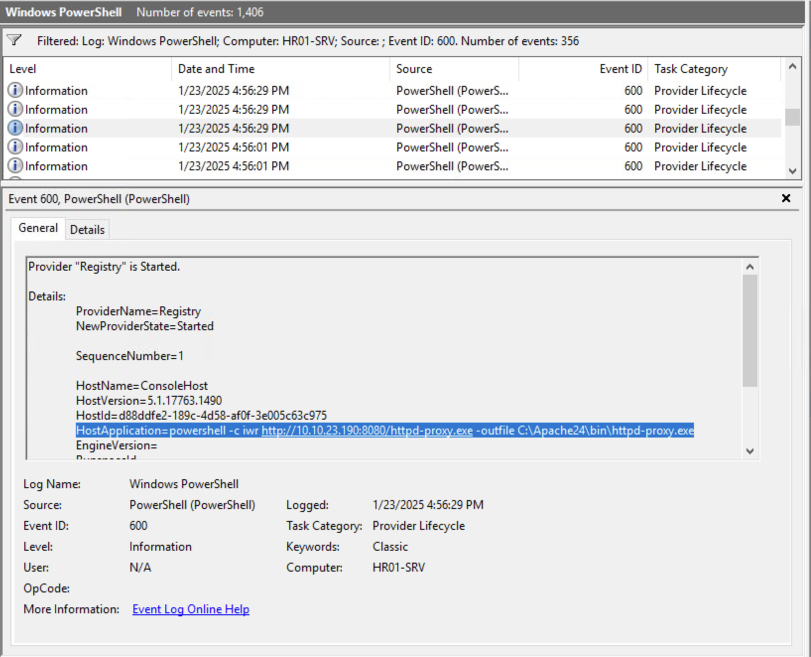

Next, I discovered another suspicious command used to exclude the downloaded file from **Windows Defender**, allowing it to avoid detection:

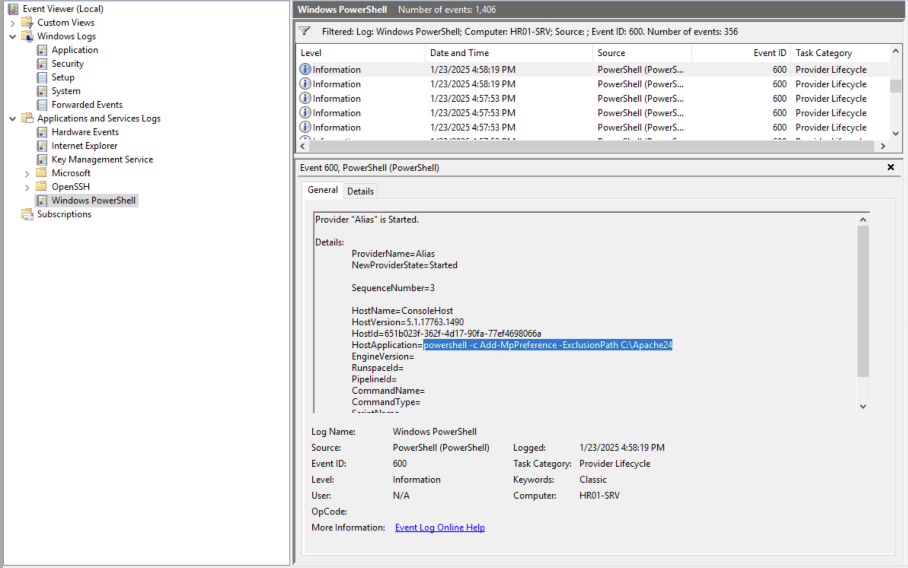

Finally, I identified that the uploaded binary was being used to tunnel **Remote Desktop Protocol (RDP)** traffic, enabling the attacker to remotely access the compromised system:

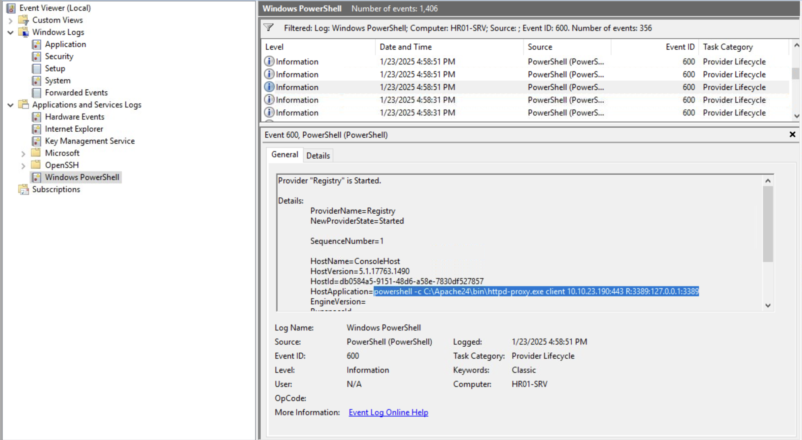

---

### Task 3: Breached Admin | RDP Session Logs

This task focuses on identifying the compromised RDP session.

I analyzed the **TerminalServices-LocalSessionManager** logs (Operational channel), which contain events related to Remote Desktop sessions.

I first filtered the logs using **Event ID 21** to identify successful RDP logons. Here I found a successful login originating from the attacker's IP address, including information about the compromised user account:

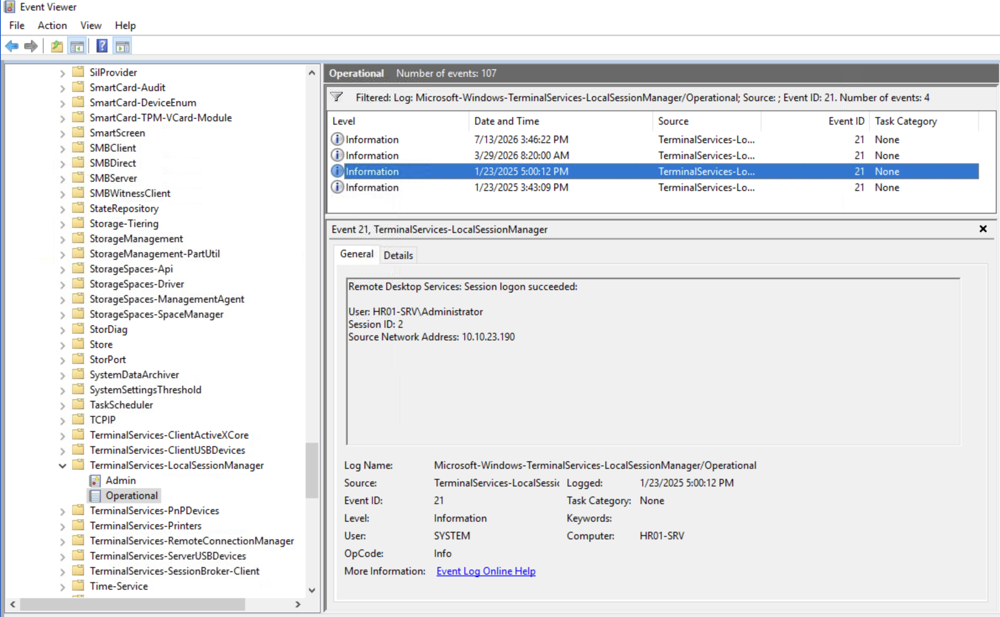

I then filtered the logs using **Event ID 24** to identify the corresponding disconnect event, confirming when the attacker terminated the compromised RDP session:

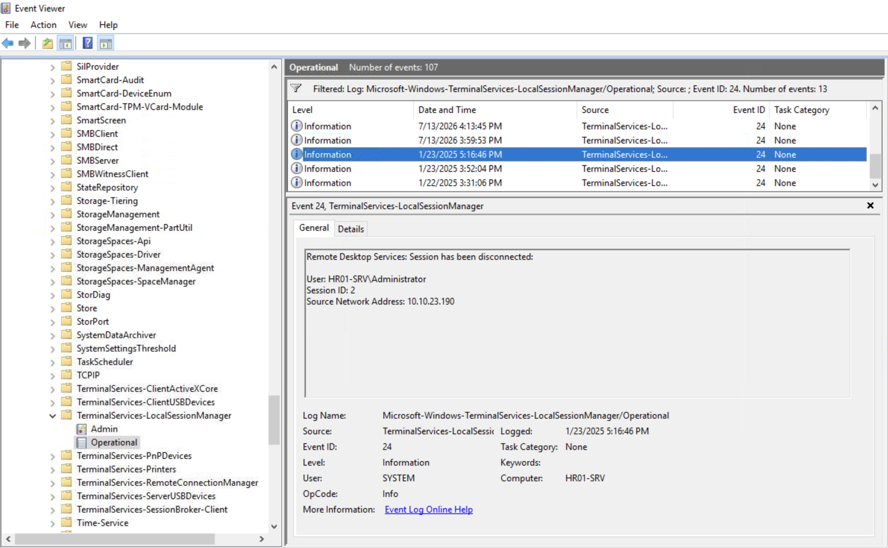

---

### Task 4: Persistence Traces | Scheduled Tasks

This task focuses on identifying the persistence mechanism established by the attacker.

I analyzed the **TaskScheduler Operational** logs to detect malicious scheduled tasks.

First, I filtered the logs using **Event ID 106**, which records newly created scheduled tasks. This allowed me to identify the malicious task created by the attacker:

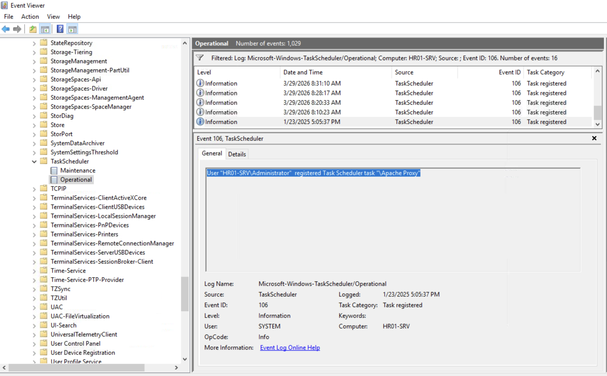

Next, I opened the **Task Scheduler** GUI to inspect the task configuration and identify its trigger and associated action:

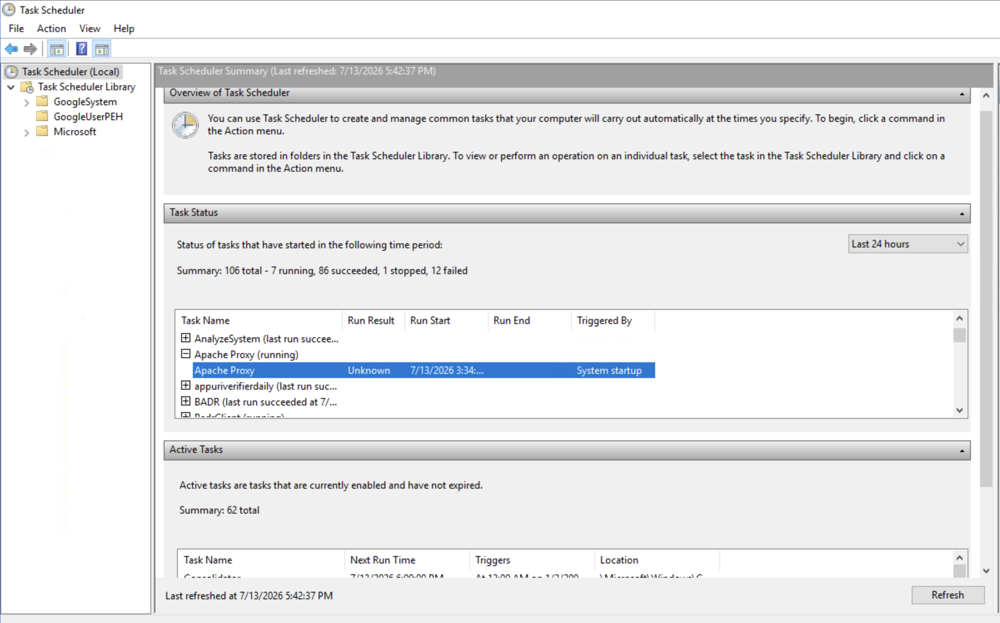

The final objective was to determine the exact PowerShell command executed by the scheduled task. I first filtered the TaskScheduler logs using **Event ID 129** to identify when the task started. I then correlated the execution time with the **PowerShell Operational Logs**, allowing me to recover the complete PowerShell command executed by the attacker:

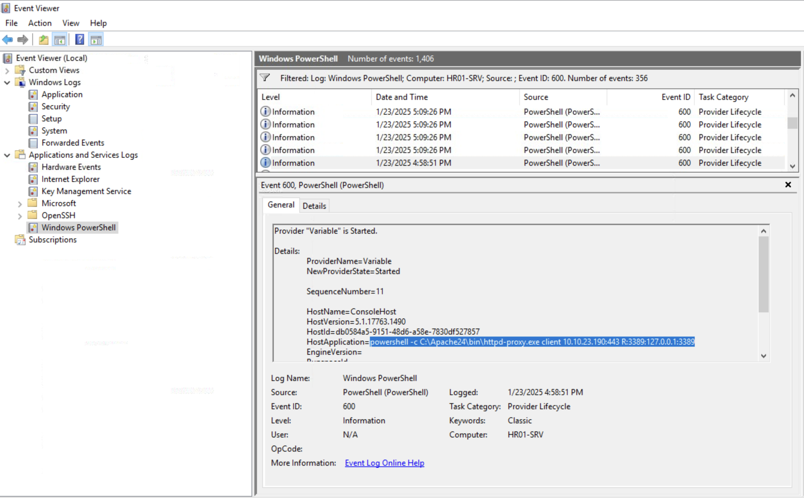

---

### Task 5: Credential Access | Windows Defender

The objective of the final task is to analyze **Windows Defender** logs and identify evidence of credential theft.

I started by filtering the Windows Defender logs using **Event ID 1116**, which records malware detections. By correlating the timestamps with the previous findings, I identified the first malware detected by Windows Defender, including the name of the quarantined file:

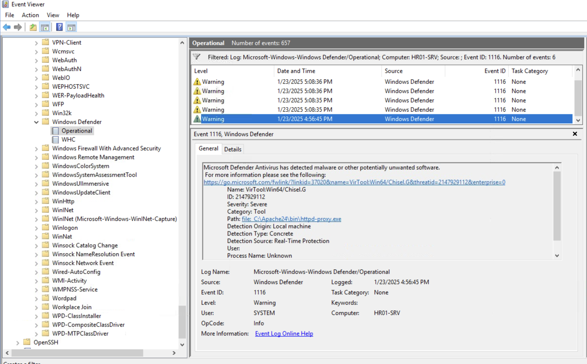

Continuing the investigation, I identified another detection corresponding to **Mimikatz**, a well-known post-exploitation tool used to extract credentials from compromised Windows systems:

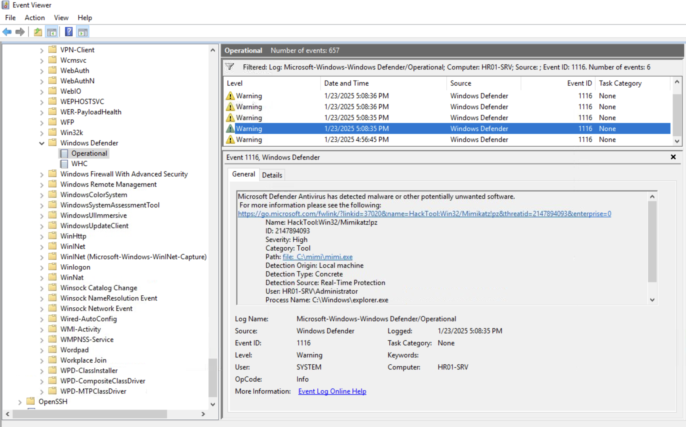

After identifying the downloaded Mimikatz executable, I returned to the `ConsoleHost_history.txt` file to determine how it had been executed. There I found the command used by the attacker, confirming that credentials and password hashes had been extracted directly from the **LSASS** process memory:

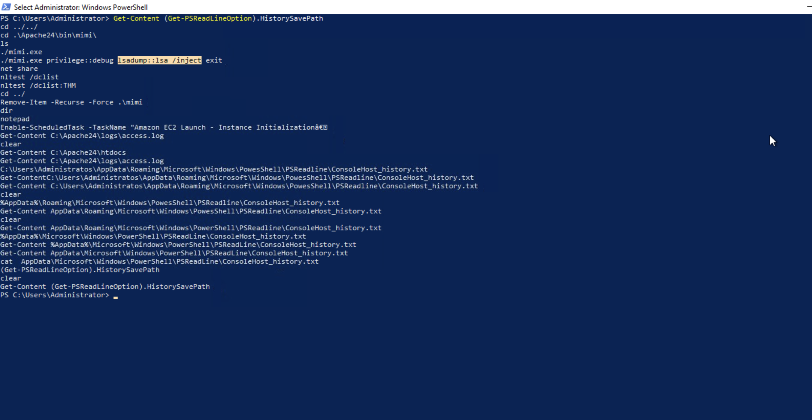

---

## Key Takeaways

- Improved my ability to investigate web access logs to identify web shell uploads and reconstruct the initial stages of an attack.
- Gained hands-on experience analyzing different Windows log sources, including PowerShell, RDP, Task Scheduler, and Windows Defender logs.
- Learned how to correlate multiple log sources to reconstruct the attack timeline from initial access to persistence and credential theft.
- Better understood how attackers establish persistence, abuse remote access services, and perform credential dumping in Windows environments.

---

## Real-World Relevance

Windows Event Logs are one of the primary sources of evidence used by SOC Analysts and Incident Responders during security investigations. Being able to correlate multiple log sources—such as PowerShell, RDP, Task Scheduler, and Windows Defender logs—allows analysts to reconstruct the attack timeline, identify attacker techniques, and support effective incident detection, containment, and remediation.
