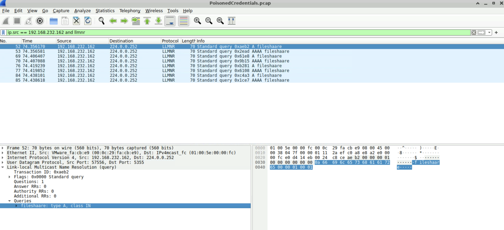
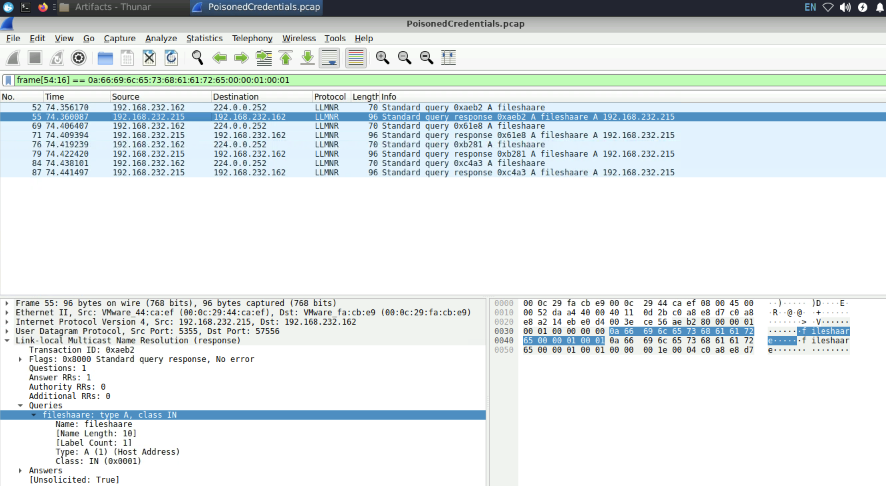
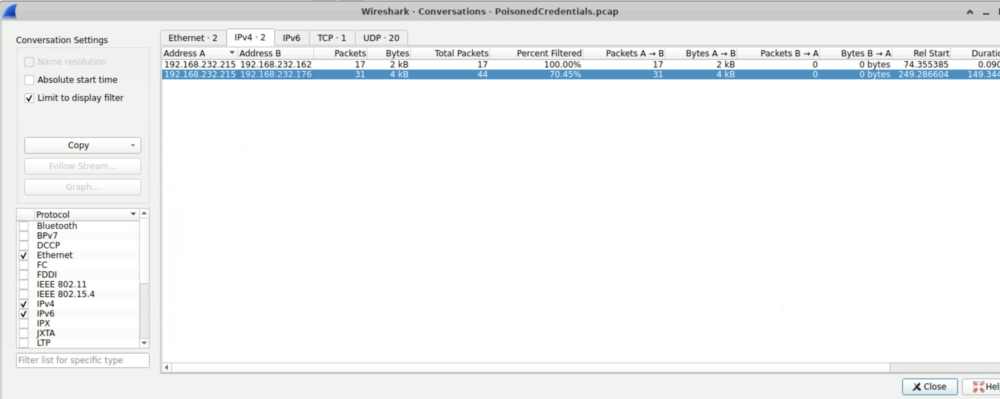
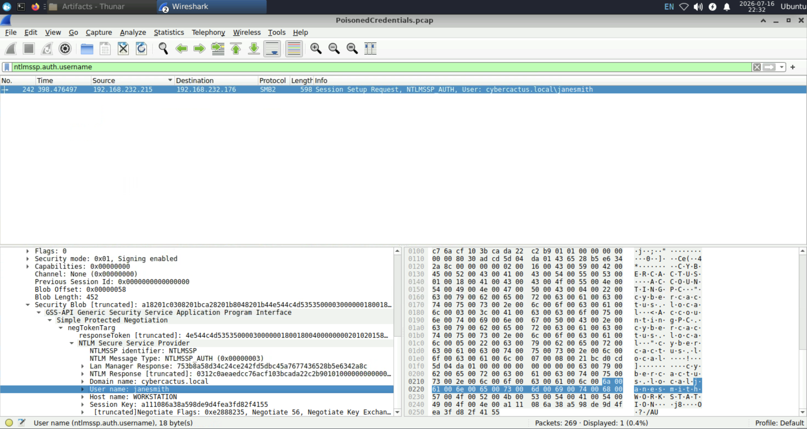
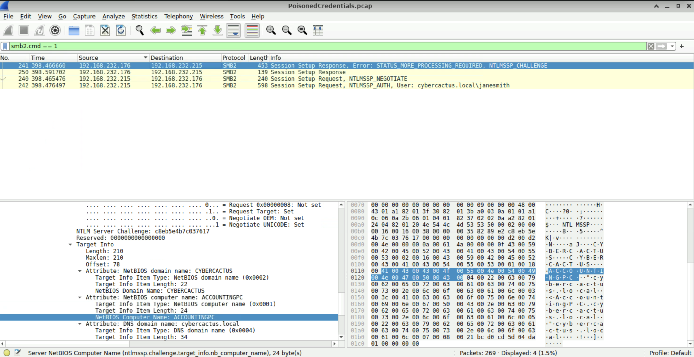

# Lab Title: PoisonedCredentials

**Platform:** Cyberdefenders 

**Category:** Network Analysis / Threat Investigation 

---

## Objective

Analyze network traffic for LLMNR/NBT-NS poisoning attacks using Wireshark to identify the rogue machine, compromised accounts, and affected systems

---

## Skills Demonstrated

- Network Forensics
- Windows Authentication Analysis
- Threat Investigation

---

## Tools Used

- Wireshark

---

## Methodology

The investigation began by identifying the malformed **LLMNR** query generated by the victim's machine, which triggered the **LLMNR poisoning** attack.

To identify the rogue machine responding to the poisoned requests, I applied as filter the string **"fileshaare"** and inspected the corresponding LLMNR response packets. This allowed me to determine the IP address of the attacker-controlled host.

Next, I investigated whether other systems had been affected by the poisoning attack. Using the **Conversations** feature under Wireshark's **Statistics** menu, I analyzed all the communications involving the rogue machine and identified a second host that had received poisoned LLMNR responses.

To assess whether user credentials had been compromised, I analyzed the **NTLM** authentication traffic and identified the username associated with the compromised account.

Finally, to understand the impact of the attack, I inspected the **SMB** traffic containing the authentication attempts. By correlating the login events, I identified the hostname of the machine accessed by the attacker and determined which user successfully authenticated to it.

---

## Key Takeaways

- Learned how to identify indicators of LLMNR poisoning through network traffic analysis.
- Improved my ability to investigate authentication protocols such as NTLM and SMB during credential compromise investigations.
- Gained hands-on experience reconstructing attacker activity by correlating multiple network artifacts and communication flows.

---

## Real-World Relevance

Man-in-the-Middle (MITM) attacks remain a common technique used by attackers to intercept authentication traffic and compromise user credentials within internal networks. Name resolution protocols such as **LLMNR** can be abused to redirect victims to rogue hosts, triggering **NTLM** authentication attempts that attackers can capture or relay. Being able to recognize the network indicators of LLMNR poisoning, analyze NTLM authentication traffic, and correlate SMB activity is an essential skill for SOC analysts and incident responders during internal network investigations.
