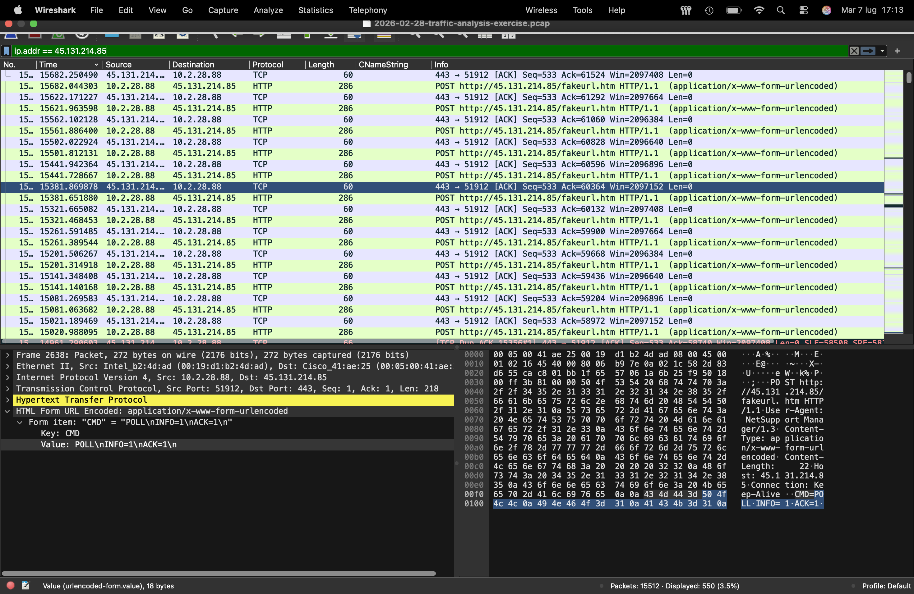
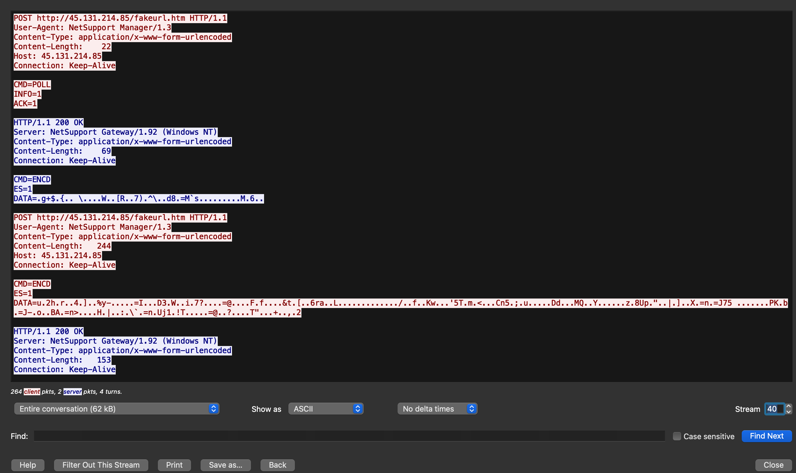
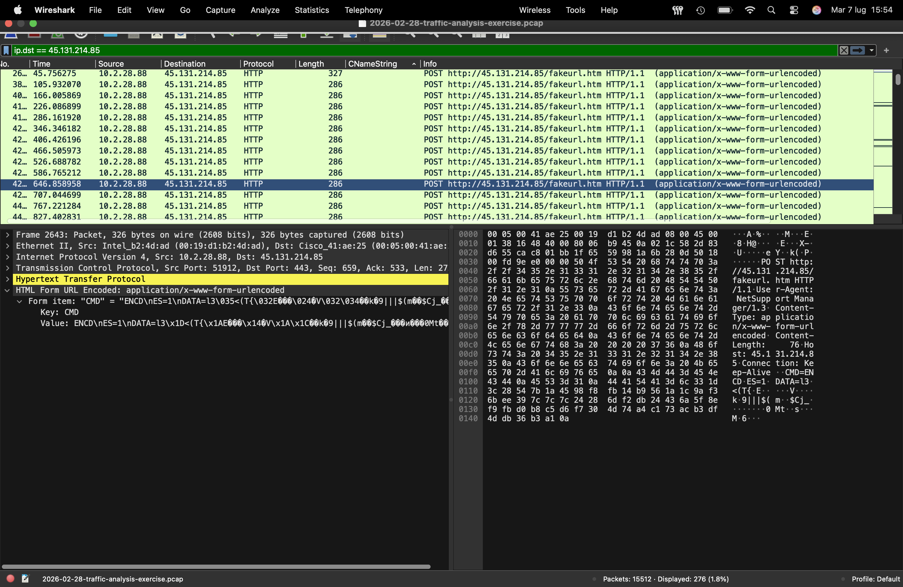
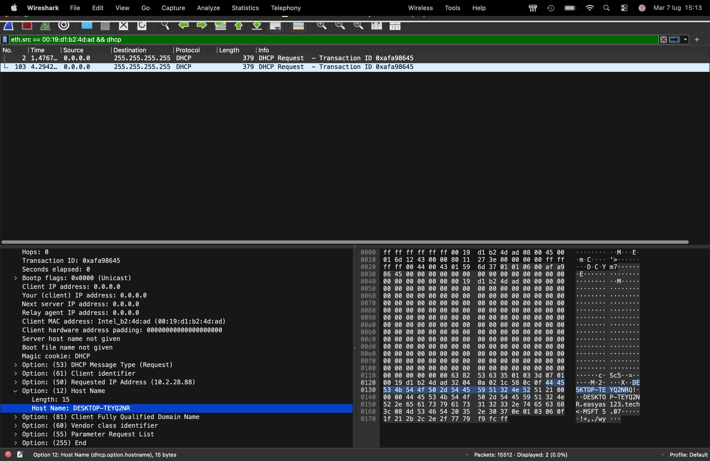
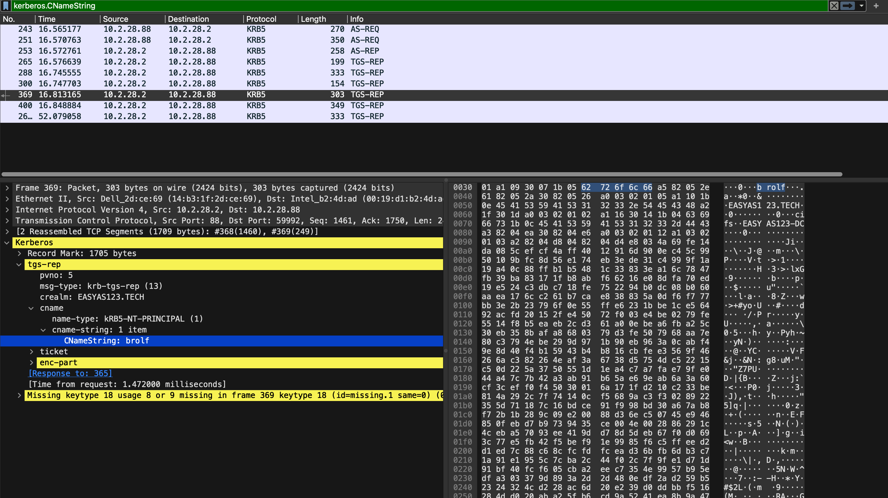
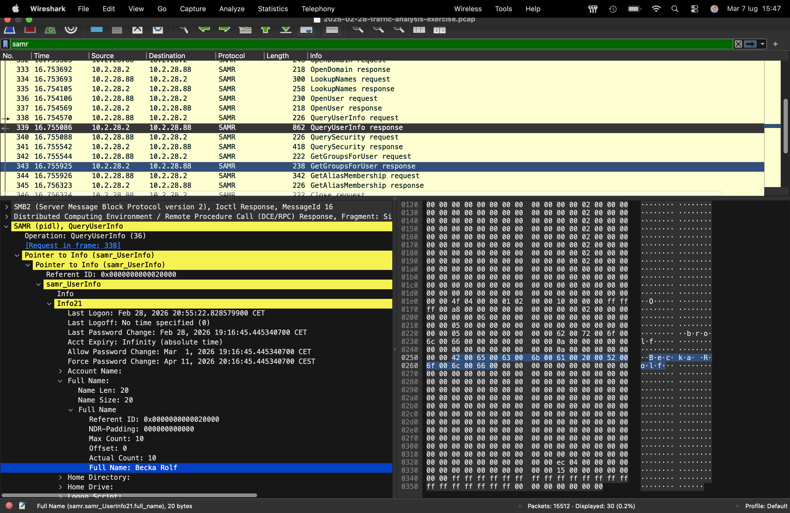

# Lab Title: 2026-02-28 - TRAFFIC ANALYSIS EXERCISE: EASY AS 123

**Platform:** Malware Traffic Analysis 
**Category:** Network Traffic Analysis / Wireshark  
**Difficulty:** Intermediate

---

## Objective

Analyze network traffic to identify malicious activity caused by a RAT. After detecting the malicious communications, identify the compromised host by determining its hostname, username, and the victim's full name.

Given the information about the Environment (including the LAN segment range, Domain, AD environment name and the Domain Controller), The Background is: 
*As dynamic go-getter at a Security Operations Center (SOC), you check the Security Information and Event Management (SIEM) system and find several signature hits for
NetSupport Manager RAT from 45.131.214[.]85 over TCP port 443. The activity started
on 2026-02-28 at 19:55 UTC*

---

## Skills Demonstrated

- Network Forensics
- Malware Traffic Analysis
- Threat Intelligence Research

---

## Tools Used

- Wireshark

---

## Methodology
During the investigation, I primarily relied on Wireshark filters combined with manual traffic inspection to reconstruct the attack and identify the compromised host.

First, I filtered the IP address provided in the *background*:

You can clearly see the communication between the malicious IP address and the victim's IP address. I then followed the **TCP stream** to analyze the communication in more detail:

While analyzing the HTTP traffic through the TCP stream, I noticed the repeated use of the `CMD=ENCD` parameter. As I was not familiar with its meaning, I performed additional research to better understand the protocol. I discovered that this parameter is commonly associated with the **NetSupport Manager RAT** and represents encoded **command-and-control communications** between the infected host and the C2 server. This finding confirmed the presence of malicious RAT activity.

Through the TCP stream, we can see that the infected host established an HTTP-based **Command and Control (C2)** channel with the remote server by periodically sending POST requests:

The initial **CMD=POLL** message was used to check for pending commands, while subsequent **CMD=ENCD** exchanges carried encoded data between the compromised host and the NetSupport Manager C2 server, maintaining persistent communication.

After identifying the attack behavior and the victim's IP address, I started looking for additional information about the compromised host.

By inspecting one of the packets, I was able to retrieve the victim's MAC address. After obtaining the MAC address, I searched for the **hostname**:

Next, I looked for the victim's username. Since the environment appeared to be using **Active Directory**, I focused on **Kerberos** traffic to identify the user account:

Finally, I checked whether I could retrieve the victim's full name. I filtered the traffic for **SAMR** (*Security Account Manager Remote Protocol*) and searched for **QueryUserInfo** requests to obtain the user's full name:

---

## Key Takeaways

- Improved my ability to investigate malware network traffic using Wireshark and manual packet analysis.
- Learned how to recognize Command and Control (C2) communications by identifying protocol-specific indicators
- Strengthened my investigative methodology by combining network analysis with external threat intelligence research to validate findings.

---

## Real-World Relevance

Network traffic analysis is a fundamental activity for SOC analysts and Incident Responders during malware investigations. Identifying C2 communications, correlating network artifacts, and extracting information about compromised hosts enables security teams to quickly detect malicious activity, understand an attacker's TTPs, and support effective incident containment.
