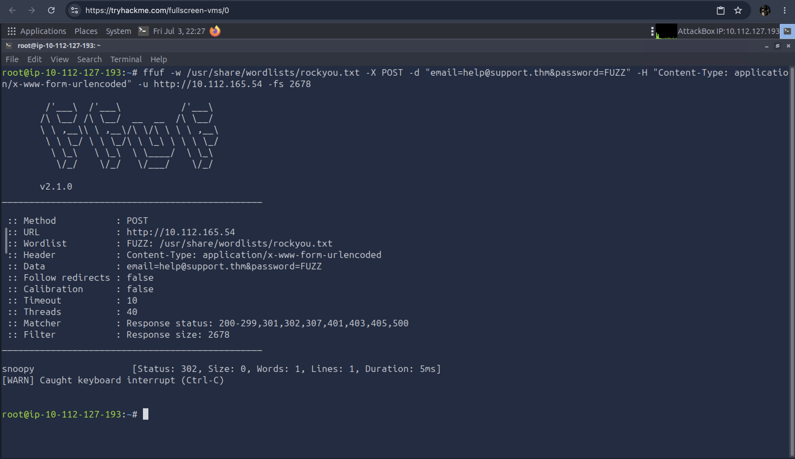
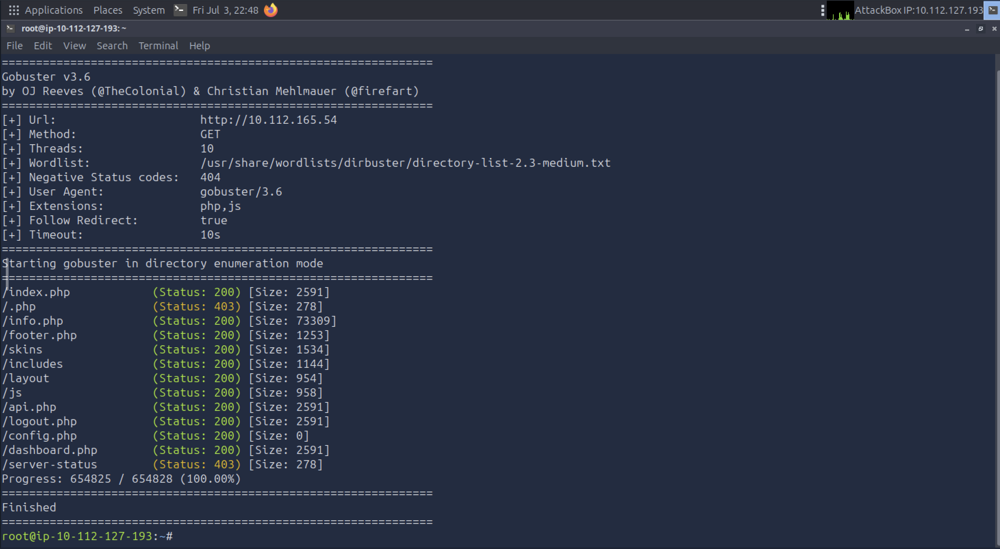
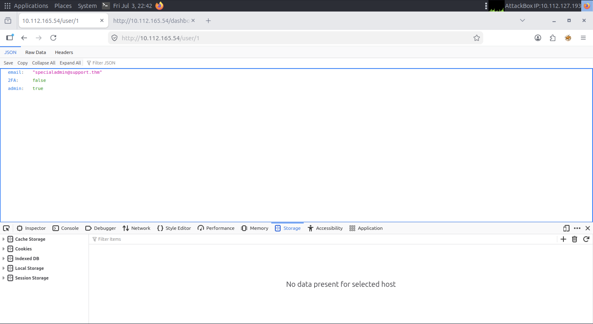
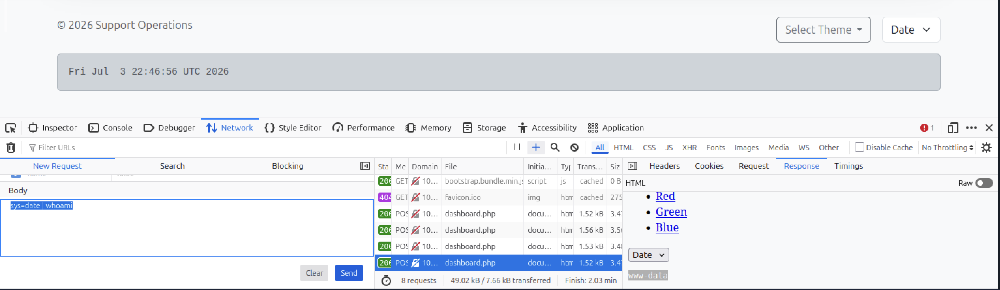

# Lab Title: "Support"

**Platform:** TryHackMe  

**Category:** Web Security  

---

## Objective

Assess the security of a web application by identifying and exploiting common API and web application vulnerabilities in order to demonstrate their impact.

---

## Skills Demonstrated

- API pentesting
- Web Application Assessment
- Authentication Testing
- Authorization Testing
- Brute Force
- Access Escalation
- Directory Enumeration

---

## Tools Used

- FFuF
- Gobuster
- Browser Developer Tools

---

## Methodology

This lab simulates a support web application exposing several common web security vulnerabilities.
I started by identifying the main support email address available on the application's homepage.
I then performed a brute-force attack against the login form using **FFuF** with the **rockyou.txt** wordlist. 
This revealed that the support account was protected by a weak password, allowing authenticated access as a standard user.

After gaining access, I performed directory enumeration using **Gobuster** to identify additional application resources and endpoints.
Next, I inspected the application's cookies using the **Firefox Developer Tools**. I discovered that one of the cookies contained the MD5 hash of the string "false".
After identifying the hash value, I generated the MD5 hash of "true" and replaced the original cookie value, effectively changing the session state to **isITUser: true** and gaining access to additional application functionality.

The newly accessible Internal User API was then analyzed. During testing, I identified a **Broken Object Level Authorization (BOLA)** vulnerability
which allowed me to modify user identifiers and retrieve information belonging to other users, including the administrator's email address.

While inspecting the application, I noticed that the dashboard.php endpoint accepted a file path through a GET parameter.
I tested the parameter for **Directory Traversal** and successfully accessed sensitive files, 
including a configuration file containing the application's master password. Using this credential together with the administrator's email address.
I successfully authenticated as the administrator.

Once authenticated with administrative privileges, I identified a feature that executed system commands on the underlying server.
By abusing this functionality, I successfully achieved **Remote Code Execution (RCE)** without relying on a web shell or reverse shell.

---

## Evidence

### FFUF

Performed a brute-force attack against the support account using the rockyou.txt wordlist, successfully identifying weak credentials.

### GOBUSTER

Enumerated hidden directories and application resources to identify additional attack surface.

### Broken Object Level Authorization (BOLA)

Confirmed the presence of a Broken Object Level Authorization vulnerability by manipulating object identifiers and accessing unauthorized user information.

### BROWSER DEVELOPER TOOL

Successfully achieved Remote Code Execution by abusing an administrative feature that executed system commands.

---

## Key Takeaways

- Learned to approach web application assessments using a structured penetration testing methodology.
- Improved my ability to identify attack paths by chaining multiple vulnerabilities instead of focusing on a single issue.
- Gained hands-on experience assessing API security and common web application misconfigurations.
- Better understood the real-world impact of insecure authentication, authorization, and input validation mechanisms.

---

## Real-World Relevance

Modern web applications and APIs are frequently targeted by attackers due to the sensitive data and functionality they expose.
The impact of chaining multiple weaknesses such as weak authentication, Broken Object Level Authorization (BOLA), Directory Traversal, and insecure functionality can lead to a complete compromise of the application.
This lab reflects a realistic penetration testing scenario where vulnerability chaining and assessment are essential to identifying the full attack path.
Understanding these attack techniques also helps defenders implement stronger authentication, authorization, input validation, and secure application design practices.

